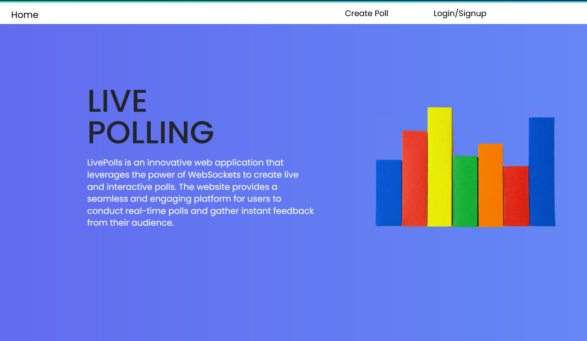
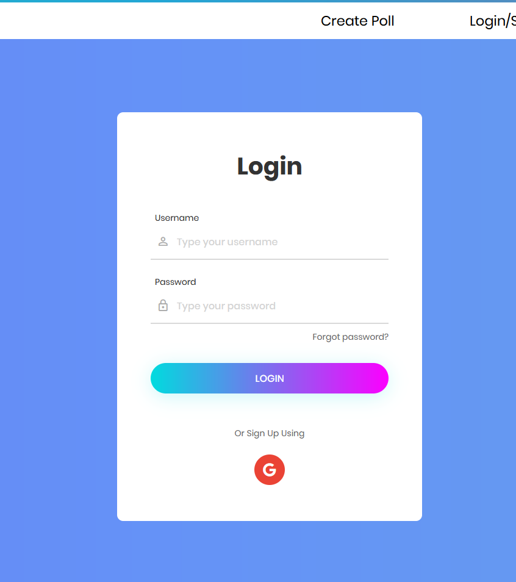
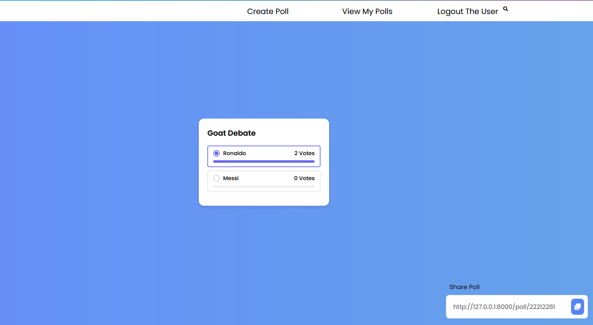
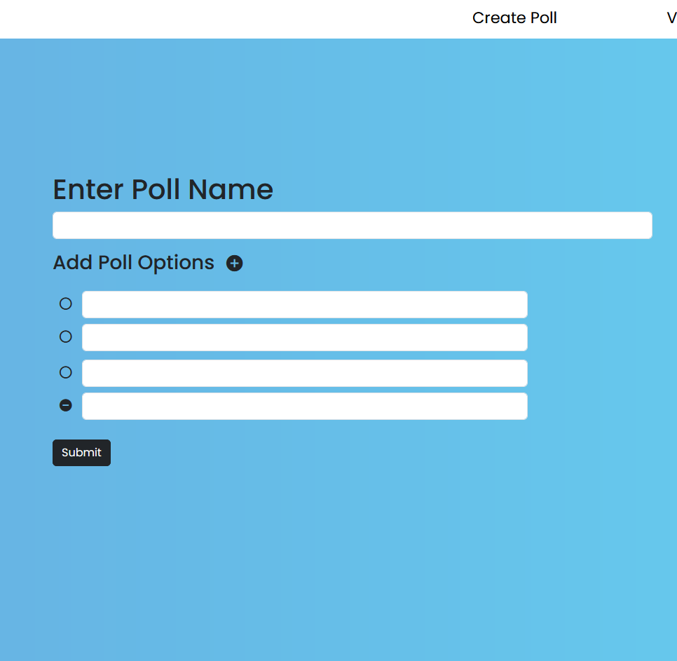
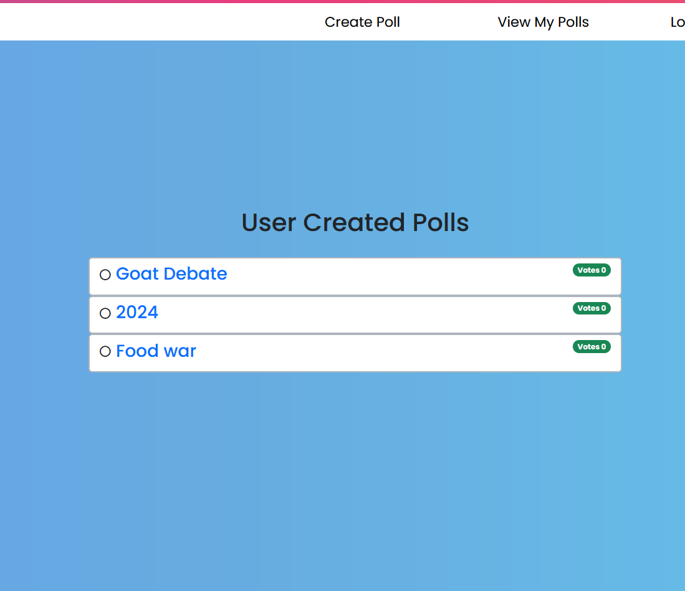

# SimplyVote
Empower Engagement, Ignite Insight: SimplyVote – Transforming Real-Time Opinions into Meaningful Conversations. (using websockets)

# Installation
* 1 - clone repo https://github.com/SuyashSalvi/simlpy_vote
* 2 - create a virtual environment and activate
    - pip3 install pipenv: dependency managment
    - pipenv install django: new proj setup
    - pipenv shell: to activate virtual environment  
* 4 - pip install -r requirements.txt
* 5 - python manage.py migrate
* 6 - Insiall Redis on your system
*   - pip install channels-redis
*   - redis-server
* 7 - python manage.py runserver

# Features
* Create Polls
* Share them with other users
* Vote on other Polls
* See the results in realtime through websockets

# Tech Stack
* Django
* Django-websockets
* sqlite
* Django Channels
* Redis
* Jquery-Ajax

# Home Page
  

# Login Page
  

# Poll Page
  

# Poll Creation Page
  

# My Polls page
  

